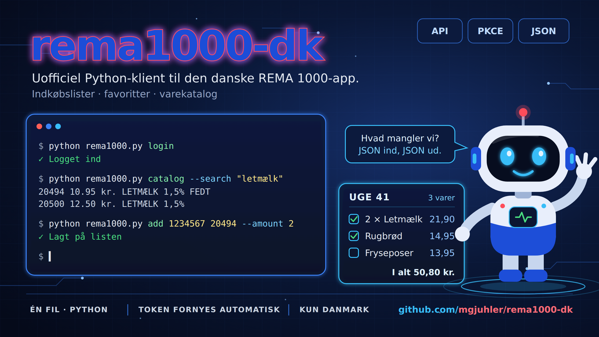

<div align="center">



</div>

# rema1000-dk

Uofficiel Python-klient og API-noter til backenden bag den **danske** REMA 1000-app
(`dk.iroots.rema1000`, Android-version 6.9.0).

Klienten er én fil, `rema1000.py`, og dækker alt det i appens backend, der stadig er i brug,
så du ikke selv skal pille appen fra hinanden. Fra et script eller en terminal kan du:

- logge ind med din egen REMA 1000-konto (OAuth 2 med PKCE, præcis som appen gør det)
- læse, oprette, omdøbe og slette indkøbslister, lægge varer på, rette antal og fjerne punkter
- læse, tilføje og fjerne favoritter og hente REMAs forslag til varer, du ofte køber
- søge i varerne med appens egen søgning, slå stregkoder op og se afdelinger og kategorier
- hente ugens avisvarer og selve tilbudsavisen (sider, tilbud og link til at bladre i den)
- finde opskrifter og butikker med åbningstider, også de nærmeste til en position
- læse og rette profil, adresser, samtykker og nyhedsbreve
- kalde et hvilket som helst andet endpoint med kommandoen `api`

Varer, søgning, tilbud, avis, opskrifter og butikker er offentlige og kræver ikke login.

Dokumentation:

- [API.md](API.md) — de vigtigste kald med eksempler.
- [`docs/api/`](docs/api/) — kortlægning af alt, hvad appen kalder, i tre dokumenter: konto og login,
  indkøb og varer, butikker og levering (126 beskrivelser; enkelte kald står i mere end ét dokument).
- [`docs/api/metoder.md`](docs/api/metoder.md) — hver metode i klienten, hvilket kald den laver,
  og om kaldet er afprøvet.

## Vigtigt at vide

- **Uofficielt.** Projektet har intet med REMA 1000 at gøre og er ikke godkendt eller
  understøttet af dem. API'et er ikke dokumenteret offentligt; beskrivelsen her bygger på,
  hvad appen sender og modtager, afprøvet mod det rigtige API 3. oktober 2026.
- **Kan gå i stykker.** Når REMA opdaterer appen eller backenden, kan endpoints, felter og
  login-flow ændre sig uden varsel.
- **Kun Danmark.** Den norske REMA-app bruger en helt anden backend (`api.rema.no`).
  [Alfredvc/rema1000-cli](https://github.com/Alfredvc/rema1000-cli) dækker den norske og
  virker **ikke** til den danske — og omvendt virker dette projekt ikke i Norge.
- **Brug det med omtanke.** Brug din egen konto, og lad være med at hamre på API'et.
  Kataloget fylder ca. 10 MB; spørg på `last_modified` først, og hent kun kataloget igen,
  når det har ændret sig.

## Installation

Kræver Python 3.9 eller nyere.

```bash
git clone https://github.com/mgjuhler/rema1000-dk.git
cd rema1000-dk
python3 -m venv .venv
. .venv/bin/activate
pip install -r requirements.txt
```

`requests` er den eneste afhængighed til daglig brug. `playwright` bruges kun af `login`
og skal have en browser installeret én gang:

```bash
playwright install chromium
```

## Login

```bash
python rema1000.py login
```

Der åbner et browservindue med REMAs egen login-side (`login.rema1000.dk`). Log ind med
e-mail og adgangskode. Klienten ser aldrig adgangskoden; den opfanger kun den sidste
omdirigering til appens eget URL-skema og bytter koden til et adgangsbevis.

Adgangsbeviserne gemmes i `~/.config/rema1000/tokens.json` med rettighederne `600`.
En anden placering vælges med `--token-file FIL` eller miljøvariablen
`REMA1000_TOKEN_FILE`.

Login kræver en maskine med skærm. Skal klienten køre på en server, så log ind på din
egen maskine og **flyt** (ikke kopiér) token-filen derhen — se næste afsnit.

### Fornyelses-beviset roterer

Adgangsbeviset gælder en time og fornyes automatisk. **Hver fornyelse udsteder et nyt
fornyelses-bevis (refresh token) og gør det gamle ugyldigt.** Derfor må token-filen kun
ligge ét sted:

- Kopierer du filen til to maskiner, virker den kun på den, der fornyer først. Den anden
  skal logge ind igen.
- Lad ikke to processer forny samtidig med samme fil.
- Læg aldrig filen i git. `.gitignore` i dette repo udelukker `tokens.json`.

## Eksempler

Fra kommandolinjen:

```bash
# Indkøbslisterne med liste-id, punkt-id og vare-id
python rema1000.py lists
python rema1000.py lists --json

# Find en vare i kataloget (kræver ikke login)
python rema1000.py catalog --search "letmælk"
python rema1000.py catalog --modified

# Læg 2 stk. af vare 123456 på liste 1001
python rema1000.py add 1001 123456 --amount 2

# Ret antallet på punkt 900001 til 3, og fjern det igen
python rema1000.py amount 1001 900001 3
python rema1000.py remove 1001 900001

# Favoritter og forslag
python rema1000.py favorites
python rema1000.py favorites --add 123456
python rema1000.py favorites --remove 123456
python rema1000.py suggestions

# Opret, omdøb og slet en liste
python rema1000.py list-create "Sommerhus"
python rema1000.py list-rename 1001 "Sommerhus uge 29"
python rema1000.py list-delete 1001

# Din profil som JSON
python rema1000.py user
```

Uden login:

```bash
# Søg med appens søgning, og se ugens avisvarer
python rema1000.py search letmælk
python rema1000.py offers --all

# Én vare, en stregkode, afdelinger med kategorier
python rema1000.py product 123456
python rema1000.py barcode 5700000000000
python rema1000.py departments

# Butikker: alle, søg på navn/adresse, eller de nærmeste til en position
python rema1000.py stores --search "eksempelby"
python rema1000.py stores --near 55.0,10.0 --json

# Tilbudsavisen: aktuelle aviser, tilbud og sider i én avis, link til at bladre
python rema1000.py newspaper
python rema1000.py newspaper --offers AVIS_ID
python rema1000.py newspaper --pages AVIS_ID
python rema1000.py newspaper --url AVIS_ID

# Opskrifter
python rema1000.py recipes --search lasagne
python rema1000.py recipes --tags

# Alt andet: kald et endpoint direkte
python rema1000.py api GET v3/feature-flags --no-auth
python rema1000.py api GET v3/products --no-auth --query "filter[is_advertised]=true" per_page=5
python rema1000.py api GET v1/user/campaigns
```

Tallene ovenfor er opdigtede eksempler. `add` tager varens id fra kataloget, mens
`amount` og `remove` tager punktets id på listen (det, `lists` viser som punkt-id).
Uden `--name` slår `add` varens navn op i kataloget, hvilket henter hele kataloget.
`list-delete` sletter listen med alt, hvad der står på den, med det samme og uden fortrydelse.
De fleste kommandoer tager `--json`, som skriver API'ets svar uforkortet; `python rema1000.py
<kommando> --help` viser mulighederne.

Som modul:

```python
from rema1000 import Rema1000, flatten_catalog, search_products

rema = Rema1000()                      # eller Rema1000(token_file="/sti/til/tokens.json")

for shopping_list in rema.lists():
    print(shopping_list["name"], len(shopping_list["items"]))

products = flatten_catalog(rema.catalog())          # offentligt, kræver ikke login
milk = search_products(products, "letmælk")[0]

first = rema.lists()[0]
rema.add_item(first["id"], first["name"], milk["name"], milk["id"], amount=2)
```

Et udpluk af metoderne — alle 89 står i [`docs/api/metoder.md`](docs/api/metoder.md):

| Metode | Gør |
|---|---|
| `login()` | Åbner browseren og gemmer adgangsbeviserne |
| `lists()` | Alle indkøbslister med punkter |
| `create_list(name)`, `rename_list(list_id, name)`, `delete_list(list_id)` | Opretter, omdøber og sletter en liste |
| `add_item(list_id, list_name, name, store_item_id, amount=1)` | Lægger en vare på en liste |
| `set_amount(list_id, list_name, item_id, amount)` | Retter antallet på et punkt |
| `remove_item(list_id, list_name, item_id)` | Fjerner et punkt |
| `sync(changes)` | Sender flere ændringer i ét kald |
| `favorites()`, `add_favorite(id)`, `remove_favorite(id)` | Favoritter |
| `favorite_suggestions()` | Varer, kontoen ofte køber, som ikke er favoritter |
| `user()`, `update_user(**felter)` | Profilen |
| `search(tekst)`, `product(id)`, `barcode(ean)` | Varesøgning, én vare, stregkodeopslag |
| `offers()`, `all_offers()` | Ugens avisvarer |
| `departments()`, `category_products(afdeling, kategori)` | Afdelinger, kategorier og varerne i en kategori |
| `catalog()`, `catalog_modified()` | Hele varekataloget og tidspunktet for seneste ændring |
| `newspapers()`, `newspaper_offers(avis_id)`, `newspaper_pages(avis_id)` | Tilbudsavisen fra Tjek |
| `recipes()`, `search_recipes(tekst)`, `recipe(slug)` | Opskrifter |
| `stores()`, `stores_near(bredde, længde)` | Butikker med åbningstider |
| `address_autocomplete(tekst)` | Adresseforslag |
| `request(metode, sti, ...)` | Et vilkårligt kald; returnerer det rå svar |

Hver metodes docstring slutter med, hvor sikker den er: `[Verified]` er kaldt mod det
rigtige API, `[From app code]` er læst ud af appen og aldrig kaldt, og `[Helper]` laver
ikke selv et kald. 49 metoder er afprøvet, 34 er kun set i appens kode.

Metoderne returnerer API'ets JSON-svar, som det er. Mangler der et gyldigt adgangsbevis,
kastes `LoginRequired`; andre fejl fra backenden kastes som `RemaError` eller
`requests.HTTPError`.

### Kald, der kræver bekræftelse

Nogle kald kan ikke fortrydes eller koster penge: sletning af kontoen (`delete_account`),
udlogning (`logout`), tilbagetrækning af et samtykke (`revoke_policy`, som kan slette
indkøbshistorikken) samt oprettelse/annullering af ordrer og betalinger. De nægter at køre,
medmindre du udtrykkeligt beder om det:

```python
rema.delete_account()               # kaster ConfirmationRequired, intet sendes
rema.delete_account(confirm=True)   # sletter kontoen
```

Spærringen sidder i `request()`, så den gælder også kommandoen `api` (her hedder det
`--yes`) og kald pakket ind i `batch()`.

### Tilbudsavisen og de indbyggede Tjek-værdier

Tilbudsavisen ligger ikke hos REMA, men hos Tjek (tidligere eTilbudsavis). Appen sender en
API-nøgle og REMAs forhandler-id med, og de værdier står som konstanter øverst i
`rema1000.py`: `TJEK_API_KEY`, `TJEK_DEALER_ID`, `TJEK_BUSINESS_ID` og `TJEK_TRACK_ID`.
Det er klientværdier, der ligger i hver eneste installeret kopi af appen — samme slags
nøgle står i enhver webside, der viser en Tjek-avis. De er ikke knyttet til en bruger og
giver kun adgang til de offentliggjorte aviser. De er med, så avisen kan hentes uden at
man selv skal finde dem i appen.

Appen indeholder også nøgler til Google, Firebase, kort, fejlrapportering og lignende.
**De er bevidst udeladt:** de hører til andre firmaers tjenester, er ikke en del af REMAs
API og kan ikke bruges til noget her.

## Test

Testene kører uden netværk og uden login:

```bash
python -m unittest discover -s tests -v
```

## Vigo er lukket — hvad der er udeladt

Vigo var REMAs tjeneste, hvor andre købte ind og leverede til døren. REMAs eget
kampagnebanner i API'et (`GET v1/campaigns`) siger "Vigo lukker pr. 1. december 2025", og
appens feature-flag for Vigo er slået fra. Klienten har derfor ingen metoder til de kald,
der kun giver mening for Vigo-bestilling eller for Vigo-indkøbere — 37 kald i alt:

| Område | Kald | Indhold |
|---|---|---|
| Bestilling og ordrer | 11 | leveringstider, opret og genbestil ordre, aktive og afsluttede ordrer, annullér, nyt tidsrum, rabatkode, bekræft/gør indsigelse mod en aflevering, `user_orderer` |
| Indkøberens handlinger | 7 | ledige opgaver, start indkøb, meld varer købt/udsolgt, send position, "fremme hos kunden", registrér aflevering, giv opgaven tilbage |
| Betaling af en ordre | 5 | start, se og annullér betaling, token til kassen, kassebonens stregkode |
| Scan Selv-kurve | 4 | hent kurv, læg vare i, ret antal, fjern vare |
| Bedømmelser | 2 | mærkater og afgivelse af bedømmelse |
| Kørebog | 5 | ruter og ture for indkøbere |
| Udbetalingskonto | 3 | banker, opret og bekræft bankkonto |

Scan Selv findes stadig i butikkerne, men i API'et lever en Scan Selv-kurv inde i en ordre
("job") og kan ikke bruges uden ordre-kaldene; derfor er kurvene udeladt sammen med dem.

Tre kald mere er udeladt, fordi de kun bruges i bestillingsforløbet, og det ikke er
afklaret, om de har en funktion uden Vigo: om en liste kan leveres eller afhentes
(`v3/shopping-lists/{id}?include=logistic_options`), afhentningstider i en butik
(`v3/stores/{store_id}/time-slots`) og foreslåede afhentningsbutikker
(`v3/users/{user_id}/suggested-stores`).

Alle 40 kald er stadig beskrevet i
[`docs/api/butikker-og-levering.md`](docs/api/butikker-og-levering.md), som de står i appens
kode. Ingen af dem er nogensinde kaldt. Vil du prøve alligevel, kan de nås med kommandoen
`api` (eller `request()`); de kald, der bestiller eller betaler, kræver `--yes`.

## Hvad er ellers ikke afprøvet

- Alt, der er mærket `[From app code]`: bl.a. deling af lister (invitation, primær liste),
  afkrydsning af punkter, ændring af profil, adresser, samtykker og nyhedsbreve, MitID,
  favoritopskrifter og varerne bag et tilbud i avisen. Kaldene er bygget, som appen bygger
  dem, men har aldrig været sendt.
- `GET v3/users/{user_id}/frequently-bought-products` ("du plejer at købe") svarede 403 for
  vores konto. Metoden `frequently_bought()` findes, men vi har ikke set et rigtigt svar.
- Bonus og personlige tilbud er ikke fundet som kald i appen.

## Tak til

[Alfredvc](https://github.com/Alfredvc) for [rema1000-cli](https://github.com/Alfredvc/rema1000-cli),
som gør det samme for den **norske** REMA-app. Det var hans projekt, der viste, at appens
API lader sig kortlægge og bruge fra en kommandolinje, og det er forbilledet for både idéen
og banneret øverst. Koden her er skrevet fra bunden mod den danske backend, som er en helt
anden end den norske.

## Licens

MIT — se [LICENSE](LICENSE). REMA 1000 er et varemærke tilhørende dets ejer; projektet
bruger kun navnet til at beskrive, hvad klienten taler med.
